# Domain Entities and Invariants

This document defines the core domain entities, their properties, and key invariants, adhering to Domain-Driven Design (DDD) principles.

## 1. User Aggregate

**Description:** The User aggregate represents a registered user of the system. It encapsulates all data and behavior related to a user's identity and state.

**Entities within the Aggregate:**
- **User (Aggregate Root):** The primary entity for user management.

**Properties of User:**
- `ID (uuid.UUID)`: Unique identifier for the user.
- `Name (string)`: The user's display name.
- `Email (string)`: The user's unique email address.
- `PasswordHash (string)`: Hashed password for authentication (never store plain passwords).
- `CreatedAt (time.Time)`: Timestamp when the user account was created.
- `UpdatedAt (time.Time)`: Timestamp of the last update to the user account.
- `IsEmailVerified (bool)`: Indicates if the user's email address has been verified.
- `DeletedAt (*time.Time, omitempty)`: Timestamp if the user account has been soft-deleted.
- `AvatarURL (*string, omitempty)`: URL to the user's avatar image.
- `DeletionDueAt (*time.Time, omitempty)`: Scheduled date for hard deletion if soft-deleted.
- `LastLoginAt (*time.Time, omitempty)`: Timestamp of the user's last successful login.
- `IsDeleted (bool)`: Flag indicating if the user account is soft-deleted.

**Invariants:**
1.  **Unique Email:** Each user must have a unique email address.
2.  **Valid Password Hash:** `PasswordHash` must always be a securely hashed representation of the user's password (e.g., using bcrypt or argon2).
3.  **Email Verification:** A user cannot log in or perform certain actions if `IsEmailVerified` is `false` (unless explicitly allowed by a use case).
4.  **Soft Deletion:** If `IsDeleted` is `true`, `DeletedAt` must be set. Soft-deleted users cannot log in and should be excluded from most queries.
5.  **Hard Deletion Schedule:** If `IsDeleted` is `true`, `DeletionDueAt` should be set to schedule the permanent removal of the user's data.

**Commands (Examples):**
- `RegisterUser(name, email, password)`
- `LoginUser(email, password)`
- `VerifyEmail(token)`
- `UpdateProfile(userID, newName, newAvatarURL)`
- `ChangePassword(userID, oldPassword, newPassword)`
- `RequestPasswordReset(email)`
- `ResetPassword(token, newPassword)`
- `SoftDeleteUser(userID)`
- `RestoreUser(userID)`
- `HardDeleteUser(userID)`

**Queries (Examples):**
- `GetUserByID(userID)`
- `GetUserByEmail(email)`
- `GetSoftDeletedUsers(retentionPeriod)`

## 2. RefreshToken Entity

**Description:** Represents a refresh token used for maintaining user sessions and issuing new access tokens without re-authentication.

**Properties of RefreshToken:**
- `ID (uuid.UUID)`: Unique identifier for the refresh token.
- `UserID (uuid.UUID)`: The ID of the user to whom this token belongs.
- `Token (string)`: The actual refresh token string (should be cryptographically secure).
- `ExpiresAt (time.Time)`: Timestamp when the token expires.
- `CreatedAt (time.Time)`: Timestamp when the token was created.
- `RevokedAt (*time.Time, omitempty)`: Timestamp if the token has been revoked.
- `Revoked (bool)`: Flag indicating if the token has been revoked.
- `IPAddress (string)`: IP address from which the token was issued.
- `UserAgent (string)`: User-Agent string from which the token was issued.

**Invariants:**
1.  **Valid User:** `UserID` must always refer to an existing user.
2.  **Expiration:** An expired token (`ExpiresAt` in the past) is invalid.
3.  **Revocation:** A revoked token (`Revoked` is `true` or `RevokedAt` is set) is invalid.
4.  **Token Rotation:** When a refresh token is used to issue a new access token, the old refresh token should be revoked and a new one issued (if rotation is enabled).

## 3. Email Entity

**Description:** Represents an email sent by the system, primarily for tracking verification or notification emails.

**Properties of Email:**
- `ID (uuid.UUID)`: Unique identifier for the email record.
- `UserID (uuid.UUID)`: The ID of the user to whom the email was sent.
- `Type (string)`: The type of email (e.g., "verification", "password_reset", "notification").
- `SentAt (time.Time)`: Timestamp when the email was sent.

**Invariants:**
1.  **Valid User:** `UserID` must always refer to an existing user.
2.  **Type Definition:** `Type` should be from a predefined set of email types.

## 4. DeletionCapacity Entity

**Description:** Tracks the number of user deletions processed on a given day to enforce rate limits.

**Properties of DeletionCapacity:**
- `Day (time.Time)`: The specific day for which the capacity is tracked (truncated to date).
- `Count (int)`: The number of deletions processed on that day.
- `MaxLimit (int)`: The maximum allowed deletions for that day.
- `UpdatedAt (time.Time)`: Timestamp of the last update to this record.

**Invariants:**
1.  **Unique Day:** There should be only one record per day.
2.  **Limit Enforcement:** `Count` must not exceed `MaxLimit` for new deletions.

## 5. UserDeletion Entity

**Description:** Represents a scheduled user deletion, tracking its state and recovery options.

**Properties of UserDeletion:**
- `ID (uuid.UUID)`: Unique identifier for the deletion request.
- `UserID (uuid.UUID)`: The ID of the user scheduled for deletion.
- `ScheduledDate (time.Time)`: The date when the hard deletion is scheduled to occur.
- `Executed (bool)`: Flag indicating if the hard deletion has been performed.
- `CreatedAt (time.Time)`: Timestamp when the deletion request was created.
- `Status (string)`: Current status of the deletion (e.g., "scheduled", "pending_recovery", "executed").
- `Token (*string, omitempty)`: Optional token for deletion confirmation/cancellation.
- `TokenExpiresAt (*time.Time, omitempty)`: Expiration for the confirmation token.
- `RecoveryToken (*string, omitempty)`: Optional token for account recovery.
- `RecoveryTokenExpiresAt (*time.Time, omitempty)`: Expiration for the recovery token.

**Invariants:**
1.  **Valid User:** `UserID` must always refer to an existing user.
2.  **Scheduled Date:** `ScheduledDate` must be in the future relative to the request creation.
3.  **Status Flow:** The `Status` should transition logically (e.g., from "scheduled" to "executed").

## Simple Diagram (Conceptual)

```mermaid
classDiagram
    direction LR

    class User {
        +ID
        +Name
        +Email
        +PasswordHash
        +IsEmailVerified
        +IsDeleted
        +DeletedAt
        +DeletionDueAt
        +LastLoginAt
    }

    class RefreshToken {
        +ID
        +UserID
        +Token
        +ExpiresAt
        +Revoked
        +IPAddress
        +UserAgent
    }

    class Email {
        +ID
        +UserID
        +Type
        +SentAt
    }

    class DeletionCapacity {
        +Day
        +Count
        +MaxLimit
    }

    class UserDeletion {
        +ID
        +UserID
        +ScheduledDate
        +Executed
        +Status
    }

    User "1" -- "*" RefreshToken : has
    User "1" -- "*" Email : sends
    User "1" -- "*" UserDeletion : schedules
    DeletionCapacity "1" -- "1" UserDeletion : tracks

    class UserRepository {
        <<interface>>
        +CreateUser()
        +GetUserByID()
        +GetUserByEmail()
        +UpdateUser()
        +DeleteUser()
        +GetSoftDeletedUsers()
        +HardDeleteUser()
    }

    class RefreshTokenRepository {
        <<interface>>
        +CreateRefreshToken()
        +GetRefreshTokenByToken()
        +UpdateRefreshToken()
        +RevokeRefreshToken()
        +RevokeAllUserTokens()
    }

    class EmailRepository {
        <<interface>>
        +CreateEmail()
        +GetEmailsByUserIDAndType()
    }

    class DeletionCapacityRepository {
        <<interface>>
        +GetDeletionCapacity()
        +IncrementDeletionCapacity()
    }

    class UserDeletionRepository {
        <<interface>>
        +CreateUserDeletion()
        +GetUserDeletionsByDate()
    }

    User .. UserRepository : uses
    RefreshToken .. RefreshTokenRepository : uses
    Email .. EmailRepository : uses
    DeletionCapacity .. DeletionCapacityRepository : uses
    UserDeletion .. UserDeletionRepository : uses

    class UserApplicationService {
        +Register()
        +Login()
        +Logout()
        +RecoverPassword()
        +DeleteAccount()
        +RecoverAccount()
        +GetUserByID()
        +GetUserByEmail()
        +RefreshToken()
        +VerifyEmail()
        +ResendVerificationEmail()
    }

    UserApplicationService .. UserRepository : uses
    UserApplicationService .. RefreshTokenRepository : uses
    UserApplicationService .. EmailRepository : uses
    UserApplicationService .. DeletionCapacityRepository : uses
    UserApplicationService .. UserDeletionRepository : uses

    class RegisterUser {
        <<usecase>>
        +Execute()
    }
    class LoginUser {
        <<usecase>>
        +Execute()
    }
    class RecoverPassword {
        <<usecase>>
        +Execute()
    }
    class DeleteUser {
        <<usecase>>
        +Execute()
    }
    class VerifyTokenAndResetPassword {
        <<usecase>>
        +Execute()
    }
    class VerifyToken {
        <<usecase>>
        +Execute()
    }
    class ResendVerificationEmail {
        <<usecase>>
        +Execute()
    }

    UserApplicationService .. RegisterUser : orchestrates
    UserApplicationService .. LoginUser : orchestrates
    UserApplicationService .. RecoverPassword : orchestrates
    UserApplicationService .. DeleteUser : orchestrates
    UserApplicationService .. VerifyTokenAndResetPassword : orchestrates
    UserApplicationService .. VerifyToken : orchestrates
    UserApplicationService .. ResendVerificationEmail : orchestrates

    class UserHandlers {
        <<presentation>>
        +Register()
        +Login()
        +Logout()
        +RefreshToken()
        +ResendVerificationEmail()
        +VerifyEmail()
        +GetMe()
    }

    UserHandlers .. UserApplicationService : calls

    class HealthHandler {
        <<presentation>>
        +Healthz()
        +Readyz()
    }

    HealthHandler .. Infrastructure : checks

    class Infrastructure {
        +Postgres
        +Redis
        +NatsConn
    }

    Infrastructure .. UserRepository : implements
    Infrastructure .. RefreshTokenRepository : implements
    Infrastructure .. EmailRepository : implements
    Infrastructure .. DeletionCapacityRepository : implements
    Infrastructure .. UserDeletionRepository : implements

```

